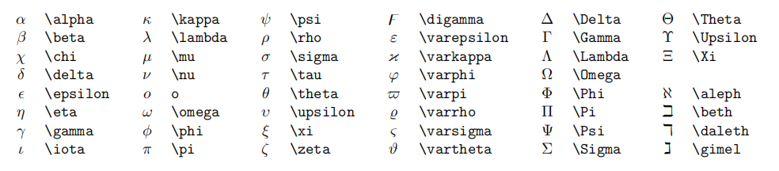

## Latex

一、公式

行内公式  
$x^2 + y^2 = 1 \text{单位圆}$

公式块
$$
x^2 + y^{12} = 1 \\
x_2 + y_{12} = 1
$$

注：不要在公式内使用中文（包括中文逗号），除非是 \text{中文}

二、分式

较小的行内行分数 $\frac{1}{2}$

展示型的分式 $\displaystyle \frac{x+1}{x-1}$

其中 \displaystyle 用于将行内展示转为块状展示

三、根式

开平方 $\sqrt{2}$

开n次方 $\sqrt[n]{2}$

四、累加、累乘和积分

累加 $\sum_{k=1}^n \frac{1}{k} \qquad \displaystyle \sum_{k=1}^n \frac{1}{k}$

累乘 $\prod_{k=1}^n \frac{1}{k} \qquad \displaystyle \prod_{k=1}^n \frac{1}{k}$

积分 $\displaystyle \int_0^1 x{\rm d}x \qquad \iint_{D_{xy}} \qquad \iiint_{\Omega_{xyz}}$

五、括号修饰

用 \left 和 \right 可以让括号适配内部大小

圆括号 $\displaystyle \left(\sum_{k=1}^{n} \frac{1}{k} \right)^2$

方括号 $\displaystyle \left[\sum_{k=1}^{n} \frac{1}{k} \right]^2$

花括号 $\displaystyle \left\{\sum_{k=1}^{n} \frac{1}{k} \right\}^2$

尖括号 $\displaystyle \left\langle\sum_{k=1}^{n} \frac{1}{k} \right\rangle^2$

六、多行算式对齐

居中对齐
$$
\begin{aligned}
y & = (x + 5)^2 - (x + 1)^2 \\
  & = (x^2 + 10x + 25) - (x^2 + 2x + 1) \\
  & = 8x + 24
\end{aligned}
$$

左对齐  
$
\begin{aligned}
y & = (x + 5)^2 - (x + 1)^2 \\
  & = (x^2 + 10x + 25) - (x^2 + 2x + 1) \\
  & = 8x + 24
\end{aligned}
$

注：&的部分会自动对齐，&也可以在begin{cases}中使用

七、方程组

方程组
$$
\begin{cases}
k_{11}x_1 + \cdots + k_{1n}x_n = b_1 \\
\cdots \\
k_{n1}x_1 + \cdots + k_{nn}x_n = b_n
\end{cases}
$$

分段函数
$$
f(x) = 
\begin{cases}
x^2 & x < 0 \\
\ln(1+x) & x \geq 0
\end{cases}
$$

八、矩阵

矩阵
$$
\begin{pmatrix}
1 & 1 & \cdots & 1 \\
1 & 1 & \cdots & 1 \\
\vdots & \vdots & \ddots & \vdots \\
1 & 1 & \cdots & 1
\end{pmatrix}

\qquad

\begin{bmatrix}
1 & 1 & \cdots & 1 \\
1 & 1 & \cdots & 1 \\
\vdots & \vdots & \ddots & \vdots \\
1 & 1 & \cdots & 1
\end{bmatrix}
$$ 

行列式
$$
\begin{vmatrix}
1 & 1 & \cdots & 1 \\
1 & 1 & \cdots & 1 \\
\vdots & \vdots & \ddots & \vdots \\
1 & 1 & \cdots & 1
\end{vmatrix}
$$

九、公式编号

$$
x+2 \tag{1.2}
$$

由公式 $(1.2)$ 可得到结论

十、特殊字符

十一、零碎的重要语法

* 点乘 $\cdot$, 叉乘 $\times$, 异或 $\otimes$, 直和 $\oplus$, 加减 $\pm$, 复合 $\circ$
* 小于等于 $\leq$, 大于等于 $\geq$, 不等 $\neq$, 恒等 $\equiv$, 约等 $\approx$, 等价 $\cong$, 相似 $\sim$, 相似等于 $\simeq$, 点等 $\doteq$
* 逻辑与 $\land$, 逻辑或 $\lor$, 逻辑非 $\lnot$, 蕴涵 $\to$, 等价 $\leftrightarrow$
* 因为 $\because$, 所以 $\therefore$, 存在 $\exist$, 任意 $\forall$
* 左小箭头 $\leftarrow$, 右小箭头 $\rightarrow$, 左大箭头 $\Leftarrow$, 右大箭头 $\Rightarrow$, 右长箭头 $\xrightarrow[fgh]{abcde}$
* 属于 $\in$, 包含于 $\subset$, 真包含于 $\subseteq$, 交 $\cap$, 并 $\cup$, 空集 $\empty$
* 短向量 $\vec{x}$, 长向量 $\overrightarrow{AB}$, 上横线 $\overline{p}$
* 无限 $\infty$, 极限 $\lim$, 微分 ${\rm d}$, 偏导 $\partial$, 点求导 $\dot{y}$, 点二阶导 $\ddot{y}$, 变化量 $\Delta$, 梯度 $\nabla$
* 横省略 $\cdots$, 竖省略 $\vdots$, 斜省略 $\ddots$
* 常见函数 $\sin$, $\cos$, $\tan$, $\arcsin$, $\arccos$, $\arctan$, $\ln$, $\log$, $\exp$

十二、latex符号整理

|        代码         |         显示          |   含义   |
| :-----------------: | :-------------------: | :------: |
|         \ne         |         $\ne$         |    -     |
|         \le         |         $\le$         |    -     |
|         \ge         |         $\ge$         |    -     |
|         \\\         |         $\\$          |   换行   |
|      a \quad b      |      $a \quad b$      |   空格   |
|     a \qquad b      |     $a \qquad b$      | 两个空格 |
|       a \\  b       |       $a \  b$        |  大空格  |
|       a \\; b       |       $a \; b$        |  中空格  |
|       a \\, b       |       $a \, b$        |  小空格  |
|       \forall       |       $\forall$       |   一切   |
|       \exists       |       $\exists$       |   存在   |
|         \in         |         $\in$         |   属于   |
|       \notin        |       $\notin$        |  不属于  |
|         \to         |         $\to$         |    -     |
|     \Leftarrow      |     $\Leftarrow$      |    -     |
|     \Rightarrow     |     $\Rightarrow$     |    -     |
|   \Leftrightarrow   |   $\Leftrightarrow$   |    -     |
| \Longleftrightarrow | $\Longleftrightarrow$ |    -     |
|        \psi         |        $\psi$         |    -     |
|        \eta         |        $\eta$         |    -     |
|       \delta        |       $\delta$        |    -     |
|      \epsilon       |      $\epsilon$       |    -     |
|        \cap         |        $\cap$         |    -     |
|        \cup         |        $\cup$         |    -     |
|      \emptyset      |      $\emptyset$      |    -     |
|     \triangleq      |     $\triangleq$      |  定义为  |

十三、字体转换

一般情况下，公式默认为意大利体 \t，此外比较常用的为罗马体 \rm。

本行的两个 `d` 采用不同的字体形式：$dx$ 和 ${\rm{d}}x$

十四、颜色设置

方法1：\<font\> 包裹公式。 $x = a^2 + b^2$ 

方法2：Latex 自带的 \color{#rgb}{text}。$\color{green}{x = a^2 + b^2}$

十五、附注

[参考链接1](https://zhuanlan.zhihu.com/p/366596107)

[参考链接2](https://www.jianshu.com/p/16fbd768bfe7)

推荐 VSCode 插件：HyperSnips for Math
