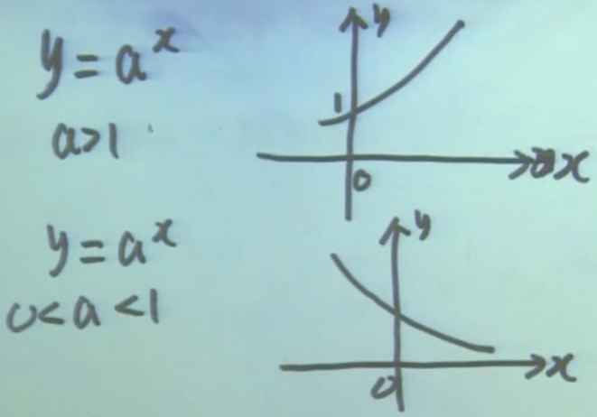
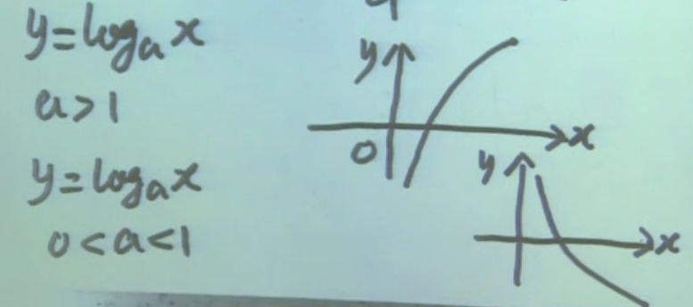
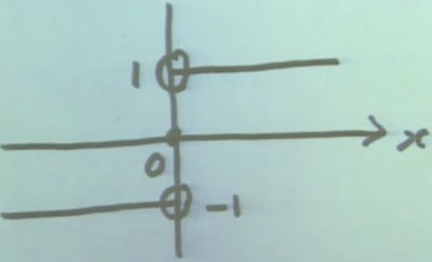
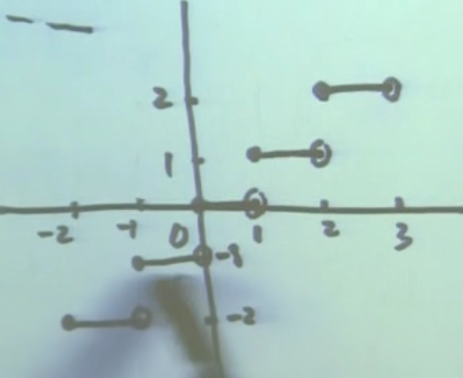

## 函数

函数是微积分的研究对象

---

一、有界函数

1.1 定义  
设 $y = f(x) \quad x \in D$

$\exist \text{常数} N \leq M$（$\exists$ 表示存在），$\forall x \in D$ 都有 $N \leq f(x) \leq M$（$\forall$ 表示一切）

则称 $f(x)$ 在 $D$ 上有界，$f(x)$ 为 $D$ 上的有界函数。$N$ 为 $f(x)$ 的一个下界，$M$ 为 $f(x)$ 的一个上界

1.2 延伸  
$\exist \text{常数} N，\forall x \in D \text{都有} N \leq f(x)$，则称 $f(x)$ 为有下界函数

$\exist \text{常数} M，\forall x \in D \text{都有} f(x) \leq M$，则称 $f(x)$ 为有上界函数

注：一个函数只要有一个下界，就有无数个下界，因为还有无数比它小的数。上界同理

1.3 定义的演变  
$\exist \text{常数} M > 0，\forall x \in D \text{都有} |f(x)| \leq M \Leftrightarrow -M \leq f(x) \leq M$

则称 $f(x)$ 在 $D$ 上有界，$f(x)$ 为 $D$ 上的有界函数

1.4 附注  
$A \Rightarrow B$，表明 $A$ 是 $B$ 的充分条件

注：福建人可以推出中国人，所以福建人是中国人的充分条件，中国人是福建人的必要条件

$A \Leftarrow B$，表明 $A$ 是 $B$ 的必要条件

注：A的充分条件是B = B是A的充分条件，指B推出A；A的必要条件是B = B是A的必要条件，指A推出B

---

二、无界函数

2.1 定义（有界函数的定义反过来写） 
$\forall \text{常数} M >0，\exists x \in D \text{使得} |f(x)| > M$

则称 $y=f(x)$ 在 $D$ 上无界，$y=f(x)$ 为 $D$ 上的无界函数

---

三、复合函数

3.1 定义  
设 $y=f(u)$，$u \in D(f)$

$\quad u=\psi(x)$，$u \in R(\psi)$

$\quad D(f) \cap R(\psi) \neq \emptyset$

称 $y=f(\psi(x))$ 为 $x$ 的复合函数。$x$ 为自变量，$y$ 为因变量，$u$ 为中间变量，$y=f(u)$ 为外函数，$\psi(x)$ 为内函数

3.2 说明
* 限制 $D(f) \cap R(\psi) \neq \emptyset$，因为诸如 $y=\sqrt u，u=-(1+x^2) \Rightarrow y=\sqrt {-(1+x^2)}$ 是没有意义的
* 事实上，在判断 $y=f(u)$ 和 $u=\psi(x)$ 能否进行复合时，只需确定 $y=f(\psi(x))$ 的定义域不为空即可

3.3 附注  
$D(f)$ 表示 $f$ 的定义域，$R(\psi)$ 表示 $\psi$ 的值域

---

四、反函数

4.1 定义

设 $y=f(x) \; x \in D$

$\forall x_1,x_2 \in D \text{且} x_1 \neq x_2，\text{都有} f(x_1) \neq f(x_2)，\text{即} y=f(x)$ 为一一对应关系。说明 $\forall y \in R(f)$ 存在唯一的 $x \in D(f)$ 与之对应

满足上述条件的一个定义域在 $R(f)$ 上的函数 $x = f^{-1}(y)$，称为 $y=f(x)$ 的反函数

* 对于 $x = f^{-1}(y)$，自变量是 $y$。不过习惯上自变量用 $x$ 表示，因变量用 $y$ 表示，因此将反函数改写为 $y = f^{-1}(x)$
* 反函数的定义域是函数的值域
* $f^{-1}(x)$ 的图像与 $f(x)$ 的图像关于 $y=x$ 对称

---

五、单调函数

5.1 定义

设 $y=f(x) \quad x \in D$

$\forall x_1,x_2 \in D \text{且} x_1 < x_2, \text{都有} f(x_1) \leq f(x_2)$

称 $y=f(x)$ 在 $D$ 上的递增函数

注1：根据这个定义，$y=1$ 属于递增函数  
注2：若将上面的 $f(x_1) \leq f(x_2)$ 改成 $f(x_1) \geq f(x_2)$ 就是递减函数  
注3：若将上面的 $f(x_1) \leq f(x_2)$ 改成 $f(x_1) < f(x_2)$ 就是严格递增函数

递增和递减函数统称为单调函数；严格递增和严格递减函数统称为严格单调函数

5.2 定理

若 $y = f(x) \quad x \in D$ 是严格单调函数，则必有反函数（这个反函数也会严格单调），反之则不成立

注：有反函数的连续函数，才会是严格单调函数。如 $\displaystyle f(x) = \frac{1}{x}$ 在 $(-\infty, 0)$ 和 $(0, \infty)$ 内是严格单调递减的，但在整个定义域内却不是

---

六、基本初等函数

6.1 三角函数

正弦 $\sin{x}$ 余弦 $\cos{x}$ 正切 $\tan{x}$

余切 $\displaystyle \cot{x} = \frac{1}{\tan{x}}$

正割 $\displaystyle \sec{x} = \frac{1}{\cos{x}}$ （读音：['sekənt]）

余割 $\displaystyle \csc{x} = \frac{1}{\sin{x}}$ （读音：[kəu'sekənt]）

$\displaystyle 1 + \tan^2{x} = \frac{\cos^2{x} + \sin^2{x}}{\cos^2{x}} = \frac{1}{\cos^2{x}} = \sec^2{x}$

$\displaystyle 1 + \cot^2{x} = \frac{\sin^2{x} + \cos^2{x}}{\sin^2{x}} = \frac{1}{\sin^2{x}} = \csc^2{x}$

6.2 正弦函数与反函数

$y = \sin{x} \quad x \in R$，不是一一对应，它没有反函数

$\displaystyle y = \sin{x} \quad x \in [-\frac{2}{\pi}, \frac{2}{\pi}]$，是严格单调，因此有反函数
* 反函数记作 $x = arc \sin{y} \quad y \in [-1, 1]$  
  不过习惯上 $x$ 作为自变量，$y$ 作为因变量，即 $y = arc \sin{x} \quad x \in [-1, 1]$
* 以前的求法是先替换再求解：在$y = \sin{x}$ 中将 $y$ 替换为 $x$，$x$ 替换为 $y$，然后将 $y$ 移到左侧  
  上面的求法是先求解再替换：将 $x$ 移到左侧，然后将 $y$ 替换为 $x$，$x$ 替换为 $y$

6.3 所有的基本初等函数

1. 常值函数 $y = c(c为常数) \quad x \in R$
2. 指数函数 $y = a^x(a > 0, a \neq 1,常数) \quad x \in R$
3. 对数函数（指数函数的反函数） $y = log_a{x}(a > 0, a \neq 1,常数) \quad x \in (0, +\infty)$
4. 幂函数 $y = x^a(a \neq 0,常数)$
5. 六个三角函数：正弦、余弦、正切、余切、正割、余割
6. 四个反三角函数

---

七、初等函数

7.1 定义

由基本初等函数经过有限次的四则运算或复合运算，得到的函数称为初等函数
* 如果只经过有限次的四则运算，称为简单函数。如 $y = 2x$
* 不是初等函数的函数，称为非初等函数。一般来说，分段函数是非初等函数，但也不绝对
  * 非初等函数
    $
    f(x) = 
    \begin{cases}
    x^2 & x < 0 \\
    \ln(1+x) & x \geq 0
    \end{cases}
    $
  * 初等函数
    $
    \begin{aligned}
    f(x) & = 
    \begin{cases}
    -x & x \leq 0 \\
    x & x > 0
    \end{cases} \\
    & = |x| = \sqrt{x^2}
    \end{aligned}
    $   是由 $y = \sqrt{u}$ 和 $u = x^2$ 复合得到的函数

7.2 示例

$y = 2*e^{\sqrt {\sin{x}}}$ 是由 $y = 2 \quad y = e^u \quad u = \sqrt{v} \quad v = \sin{x}$ 经过复合运算和四则运算得到的初等函数

---

八、其他函数

8.1 符号函数（非初等函数）

$$
sgnx =
\begin{cases}
-1 & x < 0 \\
0  & x = 0 \\
1  & x > 0
\end{cases}
$$

8.2 取整函数（非初等函数）

$\forall x \in R, [x]$ 表示不超过 $x$ 的最大整数，称为取整函数。如：$[3.5] = 3, [4] = 4$

推理：$[x] \leq x < [x + 1]$

$$
[x] =
\begin{cases}
-1 & -1 \leq x < 0 \\
0  & 0 \leq x < 1 \\
1  & 1 \leq x < 2 \\
\cdots
\end{cases}
$$

8.3 狄利克雷函数（非初等函数）

$$
D(x) =
\begin{cases}
1 & x \text{为有理数} \\
0 & x \text{为无理数}
\end{cases}
$$

8.4 幂指函数（初等函数）

$$
\begin{aligned}
y & = x^{x} \quad x > 0 \\
  & = e^{\ln{x^{x}}} \\
  & = e^{x \ln{x}}
\end{aligned}
$$

是由 $y = e^u$ 和 $u = x \ln{x}$ 复合而成，是初等函数  
不能说是由 $y = x^u$ 和 $u=x$ 复合而成，因为 $y = x^u$ 中直接指定了两个自变量
